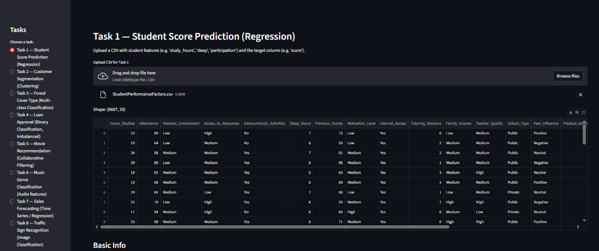

#  Machine Learning Tasks — Streamlit App

This repository contains an **all-in-one Streamlit application** (designed for Google Colab) that covers **8 core Machine Learning tasks**, ranging from beginner regression models to advanced deep learning applications.

---

## Features

###  Implemented Tasks

1. **Student Score Prediction** (Linear & Polynomial Regression)
2. **Customer Segmentation** (KMeans, DBSCAN Clustering)
3. **Forest Cover Type Classification** (Random Forest, XGBoost)
4. **Loan Approval Prediction** (Binary Classification + SMOTE)
5. **Movie Recommendation System** (Collaborative Filtering)
6. **Music Genre Classification** (Audio Features & MFCCs)
7. **Sales Forecasting** (Time Series Regression with lag features)
8. **Traffic Sign Recognition** (CNN + Transfer Learning with MobileNetV2)

---

##  Tech Stack

* **Languages & Frameworks:** Python, Streamlit
* **Libraries:**

  * Core: `pandas`, `numpy`, `matplotlib`, `seaborn`, `scikit-learn`
  * Advanced: `xgboost`, `imbalanced-learn`, `librosa`, `tensorflow`

---

##  Project Files

* `ml_full_app.py` → Main Streamlit app
* `ML_Tasks_Full_App.ipynb` → Colab notebook to run the app

---

##  How to Run in Google Colab

1. Clone the repo or upload the files to Colab.
2. Install dependencies:

   ```bash
   !pip install streamlit pyngrok seaborn scikit-learn pandas numpy matplotlib
   !pip install xgboost imbalanced-learn librosa tensorflow
   ```
3. Add your ngrok authtoken (from [ngrok dashboard](https://dashboard.ngrok.com/get-started/your-authtoken)):

   ```bash
   !ngrok config add-authtoken YOUR_AUTHTOKEN
   ```
4. Run Streamlit with ngrok:

   ```python
   from pyngrok import ngrok
   get_ipython().system_raw("streamlit run ml_full_app.py --server.port 8501 &")
   public_url = ngrok.connect(8501)
   public_url
   ```
5. Click the generated **ngrok link** → Your app is live! 


##  Key Learnings

* End-to-end ML workflows: preprocessing → model training → evaluation → deployment.
* Supervised, unsupervised, recommendation, time series, and deep learning models.
* Deploying interactive dashboards with Streamlit inside Colab.

---

## 🙌 Acknowledgements

This project was completed as part of the **Elevvo Internship Program**.

---

## 🔗 Connect

If you found this project useful, feel free to ⭐ the repo and connect with me on [LinkedIn](www.linkedin.com/in/eman-shahid-data-scientist-5639b9287).


